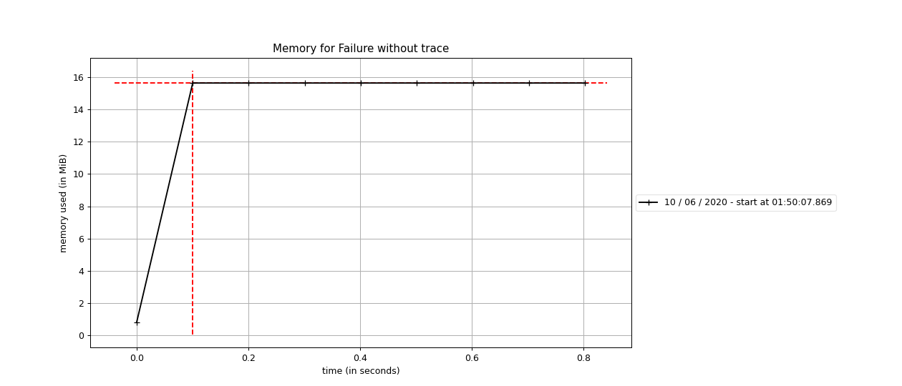
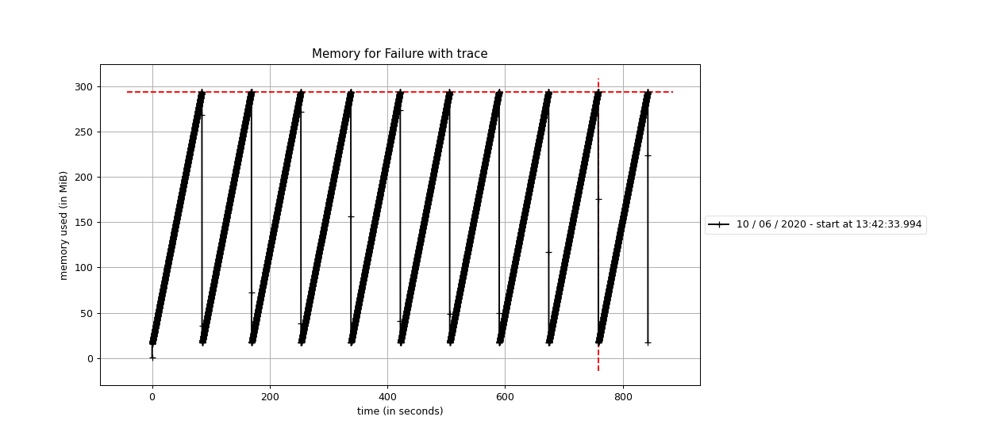

## History

A few months ago I've started to contribute with [returns](https://github.com/dry-python/returns),
an amazing Open Source Python library with a lot of containers to help us in many ways,
I won't cover those containers here but you can access the
[documentation](https://returns.readthedocs.io/en/latest/) page to know more about them.

Here I'm going to cover _why_ we chose the monkey patching technique to implements a feature,
[_Improve Failure Traceability_](https://github.com/dry-python/returns/issues/409), to the __Result__ containers.

Just a brief explanation of what is a [Result](https://returns.readthedocs.io/en/latest/pages/result.html)
container, basically your code can take two ways:

* Success, the function computation was successfully executed
* Failure, the function computation broke due to business logic or an Exception was raised

That container abstracts those ways for us, see the example below:

```python
from returns.result import Failure, Result, Success

def is_even(number: int) -> Result[int, int]:
    if arg % 2 == 0:
        return Success(number)
    return Failure(number)

assert is_even(2) == Success(2)
assert is_even(1) == Failure(1)
```

Using _Result_ can be a great idea because you don't have more to deal with raised
Business Exceptions and put `try...except` everywhere in our code, we just have to return a Failure container.

## Tracing Failure: feature explanation

_Failure_ is great, but _Exceptions_ give to us an important thing: __where it was raised__.

Inspired by [Tracing Failure](https://dry-rb.org/gems/dry-monads/1.3/tracing-failures/)
feature from [dry-rb](https://dry-rb.org/), which is a collection of Ruby Libraries,
we started the discussion to give this option to the _returns_ users and one important
thing was considered to implement it,
__users that will not use this feature can't have their system/application performance affected!__

The simple, easiest and unique (I guess) way to implement the feature is to get the call stack
and make some manipulation with it. In Python is simple to get the call stack, but it's a heavy
operation that can affect the performance if it's often called. Below you can see extracted metrics
about memory consumption when creating _Failure_ container getting the call stack and don't getting it, respectively:





## How can we implement the tracing feature?

We already know the tracing has to be optional because users that won't use it can't be affected,
and as we can see when the trace is enabled we have a huge memory overhead!

To get the trace optional we had two options:

* Use an environment variable
* Use monkey patching

By the title of this article you know might we have chosen the second option.

___Why monkey patching?___

__Monkey Patching__ is a more sophisticated and elegant approach than an environment variable,
we can separate in the right way the _tracing_ feature code from the class we want to be traced
and we don't depend on an external resource. Using an env variable will end up with something
like this in our classes, we can decouple the ___if___ statement from the class but in somewhere of our code the ___if___ will be there:

```python
import os

class Example:
    def __init__(self) -> None:
        if os.getenv('RETURNS_TRACE'):
            self._tracking = []
```

Monkey patching is a known friend of Python programmers, we use it a lot while writing tests
to mock everything we want (e.g. API request, database interaction), but it's not used too much
in our _"production"_ code because have some drawbacks like it's not __Thread Safe__ and can create
many bugs since it can affect our entire code base at runtime. But we understood that tracing
feature is to development purposes, we don't care about thread safety problem and we know exactly we are monkey patching!

> Can we turn the monkey patching technique thread safe in Python?
>
> Yes, we can but it's a subject for another article.

After some discussions, we finally delivered our [Tracing Failures](https://returns.readthedocs.io/en/latest/pages/development.html#tracing-failures)
feature, and now users can active explicit in their code the tracing for the Result containers.

```python
from returns.result import Failure, Result
from returns.primitives.tracing import collect_traces

@collect_traces
def get_failure(argument: str) -> Result[str, str]:
    return Failure(argument)

failure = get_failure('example')

for trace_line in failure.trace:
    print(f"{trace_line.filename}:{trace_line.lineno} in `{trace_line.function}`")
```

The output should be something like:
```text
/returns/returns/result.py:529 in `Failure`
/example_folder/example.py:5 in `get_failure`
/example_folder/example.py:1 in `<module>`
```

## Extra

The main goal of the ___tracing___ feature is to give to the user the ability to find where
the failure occurred, but if you don't want to analyze the call stack and know the scenario
where the failure occurs use [returns ___pytest___ plugin](https://returns.readthedocs.io/en/latest/pages/contrib/pytest_plugins.html)
to verify your hypothesis. We provide a fixture called __returns__ with __has_trace__ method, see the example below:

```python
from returns.result import Result, Success, Failure

def example_function(arg: str) -> Result[int, str]:
    if arg.isnumeric():
        return Success(int(arg))
    return Failure('"{0}" is not a number'.format(arg))

def test_if_failure_is_created_at_example_function(returns):
    with returns.has_trace(Failure, example_function):
        Success('not a number').bind(example_function)
```

If `test_if_failure_is_created_at_example_functions` fails we know the __failure__ is not created at `example_function` or in its internal calls.

## Related links

* [Hear no evil, see no evil, patch no evil: Or, how to monkey-patch safely.](https://pt.slideshare.net/GrahamDumpleton/hear-no-evil-see-no-evil-patch-no-evil-or-how-to-monkeypatch-safely)
* [Monkey Patching and its consequences](https://www.pythonforthelab.com/blog/monkey-patching-and-its-consequences/)

---

Already published on:

* [Medium](https://medium.com/@thepabloaguilar/monkey-patching-is-not-too-bad-57418951f2c4)
* [dev.to](https://dev.to/thepabloaguilar/monkey-patching-is-not-too-bad-50e5)
